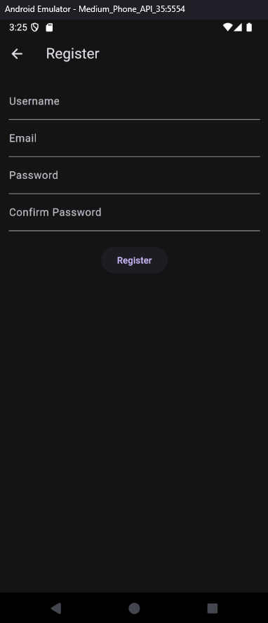

# Project

## Introduction  

We develop a **Shared To-Do List App** is built using **Flutter** and **Firebase**, allowing multiple users to collaborate on task management. Users can create, share, and manage tasks with others in real time.  

## Objective  

The objective of this project is to develop a **collaborative To-Do List App** that allows users to share and manage tasks efficiently. The app aims to:  
- Enable users to **register and log in** securely.  
- Allow users to **add, store, and manage tasks** in real-time.  
- Provide a **shared task feature** for collaboration.  
- Ensure a **user-friendly and responsive** design.  

## Project Members  
- **MUHAMMAD AL-QARDHAWI BIN AZAHAR** - 2114045  
- **MUHAMMAD AIMAN BIN JOHARI** - 2118131 
- **MUHAMMAD SYAFIQ** - 2211305 

 
## Features  
- **User Authentication**: Secure login and registration using email and password.  
- **Task Management**: Add, store, and manage tasks in Firebase.  
- **Shared Lists**: Users can share tasks with others and collaborate.  
- **Profile Page**: View and manage user profile details.
- **Settings**: Change to Dark Mode

## Tech Stack  
- **Flutter** (Dart)  
- **Firebase** (Authentication, Firestore)  
- **Cloud Firestore** (for real-time shared tasks)  
- **REST API** (for data fetching)  

## Screenshots  
| Login Page | Register Page | Incorrect Login  | Profile Page |  
|------------|--------------|------------------|--------------|  
|  |  |  |  |  
|------------|--------------|------------------|--------------| 
| Create Project | Create Task | Homepage Task  | Projects Page | 
|  |  |  |  |
|------------|--------------|------------------|--------------| 
| Projects Settings | Task List | Claim Task (Shared) | Task Claimed | 
|   |  |  |  | 


## Getting Started

```shell
- Clone the repo
- Install the dependicies
- Run it
```
## Installation & Running Instructions  

### Prerequisites  
- Install **Flutter** SDK: [Flutter Installation Guide](https://flutter.dev/docs/get-started/install)  
- Set up **Firebase** project and configure authentication & Firestore.  

### Steps  
1. **Clone the repository:**  
   ```bash
   git clone https://github.com/yourusername/MAD_GP.git
   cd MAD_GP
   ```
   
2. **Install dependicies**

```sh
flutter pub get
```

**Run project**

```sh
flutter run
```


This project is a starting point for a Flutter application.

A few resources to get you started if this is your first Flutter project:

- [Lab: Write your first Flutter app](https://docs.flutter.dev/get-started/codelab)
- [Cookbook: Useful Flutter samples](https://docs.flutter.dev/cookbook)

For help getting started with Flutter development, view the
[online documentation](https://docs.flutter.dev/), which offers tutorials,
samples, guidance on mobile development, and a full API reference.

